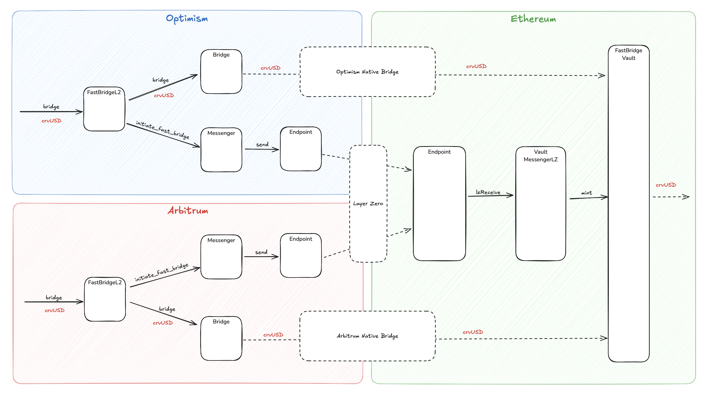

import DocCard, { DocCardGrid } from '@site/src/components/DocCard'

# FastBridge Overview

FastBridge is a workaround solution for the 7-day delay from L2 native bridges by pre-minting crvUSD. This system enables fast cross-chain transfers of crvUSD from Layer 2 networks (Arbitrum, Optimism, Fraxtal) to Ethereum mainnet.

The traditional approach to bridging assets from Layer 2 networks to Ethereum mainnet involves a significant 7-day waiting period, which creates friction for users and limits the utility of crvUSD across different networks. FastBridge addresses this challenge by implementing a dual-bridge mechanism that provides immediate access to funds while maintaining the security and reliability of the underlying bridge infrastructure.

FastBridge implements a dual-bridge mechanism that combines:

1. **Native Bridge** (slow (7d) but reliable): Direct crvUSD transfer from L2 to Ethereum
2. **Fast Bridge** (immediate): LayerZero messaging + pre-minted crvUSD release

---

## System Components

The FastBridge system consists of several key components that work together to enable fast cross-chain transfers. These components are distributed across Layer 2 networks and Ethereum mainnet, each serving a specific role in the bridging process.

<DocCardGrid>
  <DocCard title="FastBridgeL2" link="./fast-bridge-l2" linkText="View contract">

Primary coordinator on each L2 network (Arbitrum, Optimism, Fraxtal). Initiates both native and fast bridge transactions while enforcing rate limits and minimum amounts. Manages native token fees and tracks bridged amounts per 42-hour interval.

  </DocCard>
  <DocCard title="L2MessengerLZ" link="./l2-messenger-lz" linkText="View contract">

Handles LayerZero messaging from L2 to Ethereum mainnet. Encodes bridge requests and sends them through the LayerZero network to the corresponding messenger contract on Ethereum mainnet.

  </DocCard>
  <DocCard title="FastBridgeVault" link="./fast-bridge-vault" linkText="View contract">

Holds pre-minted crvUSD on Ethereum mainnet which can be released for fast bridge operations. Manages debt ceilings and fee collection, implements emergency kill switches, and handles token recovery.

  </DocCard>
  <DocCard title="VaultMessengerLZ" link="./vault-messenger-lz" linkText="View contract">

Receives LayerZero messages from L2s on Ethereum mainnet, triggers crvUSD minting in the vault, and manages the fast bridge message flow.

  </DocCard>
</DocCardGrid>

---

## Deployments

Live monitoring of FastBridge activity is available at the [FastBridge Monitor](https://curvefi.github.io/fast-bridge/).

### Vaults (Ethereum Mainnet)

| Network | Contract | Address |
|---------|----------|---------|
| Arbitrum | FastBridgeVault | [0xadB10d2d5A95e58Ddb1A0744a0d2D7B55Db7843D](https://etherscan.io/address/0xadB10d2d5A95e58Ddb1A0744a0d2D7B55Db7843D) |
| Optimism | FastBridgeVault | [0x97d024859B68394122B3d0bb407dD7299cC8E937](https://etherscan.io/address/0x97d024859B68394122B3d0bb407dD7299cC8E937) |
| Fraxtal | FastBridgeVault | [0x5EF620631AA46e7d2F6f963B6bE4F6823521B9eC](https://etherscan.io/address/0x5EF620631AA46e7d2F6f963B6bE4F6823521B9eC) |

### FastBridgeL2 Contracts

| Network | Contract | Address |
|---------|----------|---------|
| Arbitrum | FastBridgeL2 | [0x1f2af270029d028400265ce1dd0919ba8780dae1](https://arbiscan.io/address/0x1f2af270029d028400265ce1dd0919ba8780dae1) |
| Optimism | FastBridgeL2 | [0xd16d5ec345dd86fb63c6a9c43c517210f1027914](https://optimistic.etherscan.io/address/0xd16d5ec345dd86fb63c6a9c43c517210f1027914) |
| Fraxtal | FastBridgeL2 | [0x3fe593e651cd0b383ad36b75f4159f30bb0631a6](https://fraxscan.com/address/0x3fe593e651cd0b383ad36b75f4159f30bb0631a6) |

---

## How It Works

The FastBridge process involves a carefully orchestrated sequence of events that ensures both immediate access to funds and long-term security. The system operates through four main phases that work in parallel to provide users with the best possible experience.

1. User Initiates Bridge

    When a user wants to bridge crvUSD from L2 to Ethereum, they call `bridge()` on the `FastBridgeL2` contract. The contract transfers crvUSD from the user to itself and initiates both bridge paths simultaneously: native and fast.

2. Native Bridge Path (Slow)

    The `FastBridgeL2` calls the native bridge adapter, transferring crvUSD through the L2's native bridge. After 7 days, the crvUSD arrives at FastBridgeVault on Ethereum, where the vault holds the tokens for final settlement.

3. Fast Bridge Path (Immediate)

    The `FastBridgeL2` sends a message via `L2MessengerLZ`, which travels through the LayerZero network. The `VaultMessengerLZ` receives the message on Ethereum, and the vault immediately mints crvUSD to the user, allowing them to use the tokens while the native bridge is pending.

4. Settlement

    The pre-minted crvUSD is backed by the incoming native bridge transaction. When the native bridge completes, it replenishes the vault's balance mechanism.

---

## Security Model

The FastBridge system implements a comprehensive security model that addresses both technical and economic risks. The security architecture is built around multiple layers of verification, emergency controls, and risk management mechanisms that ensure the system's integrity and user fund safety.

**LayerZero Verification**

Messages are proven by 2/2 DVNs (Decentralized Verifier Networks). The LayerZero team serves as the primary verifier, while Curve core developers (SwissStake) act as the secondary verifier with maximum conservative setup.

**Emergency Controls**

The system includes a DAO Emergency Stop that can halt any mints immediately, along with kill switches that can disable specific minters or all operations. Role-based access control provides different roles for different administrative functions.

## Debt Ceilings and Limits

The FastBridge system implements multiple layers of limits to manage risk. These limits control how much crvUSD can be bridged and when.

Risk management is a critical aspect of the FastBridge system, as it involves pre-minting crvUSD tokens that are backed by pending bridge transactions. The system employs a sophisticated limit structure that balances user convenience with protocol safety, ensuring that the system can handle various market conditions while protecting against potential risks.

---

**Bridge Limits**

Each L2 network has a rate limit on how much crvUSD can be bridged within a 42-hour interval:

| Limit Type | Description | Purpose |
|------------|-------------|---------|
| **Interval Limit** | Maximum crvUSD that can be bridged per 42-hour interval | Prevents overwhelming the Ethereum claim queue |
| **Interval Tracking** | 42-hour periods (151,200 seconds) | Ensures smooth processing of bridge transactions |
| **Reset Mechanism** | Limits reset every 42 hours | Allows continuous bridging while maintaining caps |

Limits are enforced by the `FastBridgeL2` contract, where each bridge transaction reduces the available limit for the current interval. Limits are tracked using `block.timestamp // INTERVAL` where `INTERVAL = 86400 * 7 // 4` (151,200 seconds), and users can check available amounts using `allowed_to_bridge()`.

**Minimum Bridge Amounts**

To prevent uneconomical transactions, the system enforces minimum bridge amounts to prevent gas-inefficient small transactions as claiming small amounts can be expensive on Ethereum (high relative fee).

The minimum amount can be adjusted by the DAO.

---

## Emergency Controls

In case of emergencies, the system includes additional controls. The Kill Switch can stop all minting operations (KILLER_ROLE), Individual Kills can stop specific minters (KILLER_ROLE), Limit Adjustment can modify interval limits (DEFAULT_ADMIN_ROLE), and Debt Ceiling Updates can modify debt ceilings (Governance).

---

## Fee Structure

The FastBridge system implements a fee structure that balances user accessibility with operational sustainability. The vault fee is currently set to zero but is adjustable by the admin to cover operational expenses if needed.

- Native token fees on L2: Callers of `FastBridgeL2.bridge()` must provide `msg.value` covering both the native bridge fee and the LayerZero messaging fee. Any excess `msg.value` is refunded to the caller.
- Vault fee on mainnet: The vault may take a fee (with 10^18 precision) from amounts released via fast bridge. The fee is sent to `fee_receiver` and is adjustable by admin within a hard cap of 100%.
- Pre-minted release: The vault releases pre-minted crvUSD immediately upon fast message arrival; this is economically backed by the pending native bridge inflow and managed via the vault's debt-ceiling rug mechanism.
