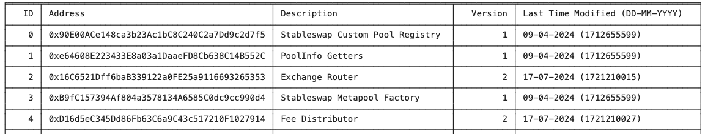

# Address Provider


The `AddressProvider` serves as the **entry point contract for Curve's various registries** and is deployed on all chains where Curve is operational. The contract holds the most important contract addresses.

:::github[GitHub]

Source code of the `AddressProvider.vy` contract can be found on [GitHub](https://github.com/curvefi/metaregistry/blob/main/contracts/AddressProviderNG.vy). A list of all deployed contracts can be found [here](../deployments.md).

The contract is deployed on :logos-ethereum: Ethereum at [`0x5ffe7FB82894076ECB99A30D6A32e969e6e35E98`](https://etherscan.io/address/0x5ffe7FB82894076ECB99A30D6A32e969e6e35E98).

<ContractABI>


```json
[{"name":"NewEntry","inputs":[{"name":"id","type":"uint256","indexed":true},{"name":"addr","type":"address","indexed":false},{"name":"description","type":"string","indexed":false}],"anonymous":false,"type":"event"},{"name":"EntryModified","inputs":[{"name":"id","type":"uint256","indexed":true},{"name":"version","type":"uint256","indexed":false}],"anonymous":false,"type":"event"},{"name":"EntryRemoved","inputs":[{"name":"id","type":"uint256","indexed":true}],"anonymous":false,"type":"event"},{"name":"CommitNewAdmin","inputs":[{"name":"admin","type":"address","indexed":true}],"anonymous":false,"type":"event"},{"name":"NewAdmin","inputs":[{"name":"admin","type":"address","indexed":true}],"anonymous":false,"type":"event"},{"stateMutability":"nonpayable","type":"constructor","inputs":[],"outputs":[]},{"stateMutability":"view","type":"function","name":"ids","inputs":[],"outputs":[{"name":"","type":"uint256[]"}]},{"stateMutability":"view","type":"function","name":"get_address","inputs":[{"name":"_id","type":"uint256"}],"outputs":[{"name":"","type":"address"}]},{"stateMutability":"nonpayable","type":"function","name":"add_new_id","inputs":[{"name":"_id","type":"uint256"},{"name":"_address","type":"address"},{"name":"_description","type":"string"}],"outputs":[]},{"stateMutability":"nonpayable","type":"function","name":"add_new_ids","inputs":[{"name":"_ids","type":"uint256[]"},{"name":"_addresses","type":"address[]"},{"name":"_descriptions","type":"string[]"}],"outputs":[]},{"stateMutability":"nonpayable","type":"function","name":"update_id","inputs":[{"name":"_id","type":"uint256"},{"name":"_new_address","type":"address"},{"name":"_new_description","type":"string"}],"outputs":[]},{"stateMutability":"nonpayable","type":"function","name":"update_address","inputs":[{"name":"_id","type":"uint256"},{"name":"_address","type":"address"}],"outputs":[]},{"stateMutability":"nonpayable","type":"function","name":"update_description","inputs":[{"name":"_id","type":"uint256"},{"name":"_description","type":"string"}],"outputs":[]},{"stateMutability":"nonpayable","type":"function","name":"remove_id","inputs":[{"name":"_id","type":"uint256"}],"outputs":[{"name":"","type":"bool"}]},{"stateMutability":"nonpayable","type":"function","name":"remove_ids","inputs":[{"name":"_ids","type":"uint256[]"}],"outputs":[{"name":"","type":"bool"}]},{"stateMutability":"nonpayable","type":"function","name":"commit_transfer_ownership","inputs":[{"name":"_new_admin","type":"address"}],"outputs":[{"name":"","type":"bool"}]},{"stateMutability":"nonpayable","type":"function","name":"apply_transfer_ownership","inputs":[],"outputs":[{"name":"","type":"bool"}]},{"stateMutability":"nonpayable","type":"function","name":"revert_transfer_ownership","inputs":[],"outputs":[{"name":"","type":"bool"}]},{"stateMutability":"view","type":"function","name":"admin","inputs":[],"outputs":[{"name":"","type":"address"}]},{"stateMutability":"view","type":"function","name":"future_admin","inputs":[],"outputs":[{"name":"","type":"address"}]},{"stateMutability":"view","type":"function","name":"num_entries","inputs":[],"outputs":[{"name":"","type":"uint256"}]},{"stateMutability":"view","type":"function","name":"check_id_exists","inputs":[{"name":"arg0","type":"uint256"}],"outputs":[{"name":"","type":"bool"}]},{"stateMutability":"view","type":"function","name":"get_id_info","inputs":[{"name":"arg0","type":"uint256"}],"outputs":[{"name":"","type":"tuple","components":[{"name":"addr","type":"address"},{"name":"description","type":"string"},{"name":"version","type":"uint256"},{"name":"last_modified","type":"uint256"}]}]}]
```

</ContractABI>


:::

:::warning[Contract Upgradability]

The `AddressProvider` contract is managed by an `admin` who is currently an individual at Curve, rather than the Curve DAO[^1]. This **admin has the ability to update, add or remove new IDs** within the contract. When integrating this contract into systems or relying on it for critical components, it is essential to consider that these **IDs and their associated addresses can be modified at any time**.

[^1]: Reasoning: Due to the nature of the contract (it does not hold any user funds or has any monetary influence), it is not considered a crucial contract. It should only be used as a pure informational source. Additionally, the Curve ecosystem changes very rapidly and therefore requires fast updates for such a contract. Always putting up a DAO vote to change IDs would not be feasible.


:::

---


## Reading IDs

For the full mapping of IDs please see [`get_id_info`](#get_id_info).

*ID information is stored in a `struct`, containing an address, a detailed description, its version, and the timestamp marking its most recent modification:*

```shell
struct AddressInfo:
    addr: address
    description: String[256]
    version: uint256
    last_modified: uint256
```

:::colab[Google Colab Notebook]

A Google Colab notebook that provides a full mapping of IDs by iterating over all `ids` via calling the `get_id_info` can be found here: [Google Colab Notebook](https://colab.research.google.com/drive/1PnvfX5E_F7_VCsmkzHrN0_OiJNsUmx9w?usp=sharing)

*The notebook is compatible with querying IDs for different chains and returns a table as shown below:*

<figure>
    
    <figcaption></figcaption>
</figure>


:::

### `ids`
::::description[`AddressProvider.ids() -> DynArray[uint256, 1000]: view`]


Getter function for all the IDs of active registry items in the AddressProvider.

Returns: active ids (`DynArray[uint256, 1000]`).

<SourceCode>


```vyper 
_ids: DynArray[uint256, 1000]

@view
@external
def ids() -> DynArray[uint256, 1000]:
    """
    @notice returns IDs of active registry items in the AddressProvider.
    @returns An array of IDs.
    """
    _ids: DynArray[uint256, 1000] = []
    for _id in self._ids:
        if self.check_id_exists[_id]:
            _ids.append(_id)

    return _ids
```


</SourceCode>

<Example>


This method returns all populated IDs.

<ContractCall address="0x5ffe7FB82894076ECB99A30D6A32e969e6e35E98" abi={["function ids() view returns (uint256[])"]} method="ids" contractName="AddressProvider" />


</Example>


::::

### `get_id_info`
::::description[`AddressProvider.get_id_info(arg0: uint256) -> tuple: view`]


Getter function to retrieve information about a specific ID.

| Input  | Type      | Description                    |
| ------ | --------- | ------------------------------ |
| `arg0` | `uint256` | ID to get the information for |

Returns: `AddressInfo` struct containing the addr (`address`), description (`String[256]`), version (`uint256`) and last_modified (`uint256`).

<SourceCode>


```vyper 
struct AddressInfo:
    addr: address
    description: String[256]
    version: uint256
    last_modified: uint256

get_id_info: public(HashMap[uint256, AddressInfo])
```


</SourceCode>

<Example>


This method returns the address of the contract, the description, the ID version (which is incremented by 1 each time the ID is updated), and the timestamp of the last modification. When calling the function for an unpopulated ID, it returns an empty `AddressInfo` struct.

<ContractCall address="0x5ffe7FB82894076ECB99A30D6A32e969e6e35E98" abi={["function get_id_info(uint256 arg0) view returns (tuple(address addr, string description, uint256 version, uint256 last_modified))"]} method="get_id_info" args={[0]} labels={["arg0"]} contractName="AddressProvider" />


</Example>


::::

### `get_address`
::::description[`AddressProvider.get_address(_id: uint256) -> address: view`]


Getter for the contract address of an ID.

| Input  | Type      | Description                        |
| ------ | --------- | ---------------------------------- |
| `_id` | `uint256` | ID to get the contract address for |

Returns: contract (`address`).

<SourceCode>


```vyper 
struct AddressInfo:
    addr: address
    description: String[256]
    version: uint256
    last_modified: uint256

get_id_info: public(HashMap[uint256, AddressInfo])

@view
@external
def get_address(_id: uint256) -> address:
    """
    @notice Fetch the address associated with `_id`
    @dev Returns empty(address) if `_id` has not been defined, or has been unset
    @param _id Identifier to fetch an address for
    @return Current address associated to `_id`
    """
    return self.get_id_info[_id].addr
```


</SourceCode>

<Example>


This method returns the address of an ID.

<ContractCall address="0x5ffe7FB82894076ECB99A30D6A32e969e6e35E98" abi={["function get_address(uint256 _id) view returns (address)"]} method="get_address" args={[0]} labels={["_id"]} contractName="AddressProvider" />


</Example>


::::

### `check_id_exists`
::::description[`AddressProvider.check_id_exists(arg0: uint256) -> bool: view`]


Function to check if an ID exists.

| Input  | Type      | Description |
| ------ | --------- | ----------- |
| `arg0` | `uint256` | ID to check |

Returns: true or false (`bool`).

<SourceCode>


```vyper 
check_id_exists: public(HashMap[uint256, bool])
```


</SourceCode>

<Example>


This method checks if a certain ID exists.

<ContractCall address="0x5ffe7FB82894076ECB99A30D6A32e969e6e35E98" abi={["function check_id_exists(uint256 arg0) view returns (bool)"]} method="check_id_exists" args={[0]} labels={["arg0"]} contractName="AddressProvider" />


</Example>


::::

### `num_entries`
::::description[`AddressProvider.num_entries() -> uint256: view`]


Getter for the number of entries. The count increments by one upon calling `_add_new_id` and decreases by one upon calling `_remove_id`.

Returns: number of entries (`uint256`).

<SourceCode>


```vyper 
num_entries: public(uint256)
```


</SourceCode>

<Example>


This method returns the total number of IDs added to the `AddressProvider`.

<ContractCall address="0x5ffe7FB82894076ECB99A30D6A32e969e6e35E98" abi={["function num_entries() view returns (uint256)"]} method="num_entries" contractName="AddressProvider" />


</Example>


::::

---


## Adding, Removing and Updating IDs

IDs can be added, removed, or adjusted by the `admin` of the contract. 

:::warning[Contract Upgradability]

The `AddressProvider` contract is managed by an `admin` who is currently an individual at Curve, rather than the Curve DAO[^1]. This **admin has the ability to update, add or remove new IDs** within the contract. When integrating this contract into systems or relying on it for critical components, it is essential to consider that these **IDs and their associated addresses can be modified at any time**.

[^1]: Reasoning: Due to the nature of the contract (it does not hold any user funds or has any monetary influence), it is not considered a crucial contract. It should only be used as a pure informational source. Additionally, the Curve ecosystem changes very rapidly and therefore requires fast updates for such a contract. Always putting up a DAO vote to change IDs would not be feasible.


:::

### `update_id`
::::description[`AddressProvider.update_id(_id: uint256, _new_address: address, _new_description: String[64])`]


:::guard[Guarded Method]

This function can only be called by the `admin` of the contract.


:::

Function to update the address and description of an ID.

| Input              | Type         | Description     |
| ------------------ | ------------ | --------------- |
| `_id`              | `uint256`    | ID to update    |
| `_new_address`     | `address`    | New address     |
| `_new_description` | `String[64]` | New description |

Emits: `EntryModified` event.

<SourceCode>


```vyper 
event EntryModified:
    id: indexed(uint256)
    version: uint256

@external
def update_id(
    _id: uint256,
    _new_address: address,
    _new_description: String[64],
):
    """
    @notice Update entries at an ID
    @param _id Address assigned to the input _id
    @param _new_address Address assigned to the _id
    @param _new_description Human-readable description of the identifier
    """
    assert msg.sender == self.admin  # dev: admin-only function
    assert self.check_id_exists[_id]  # dev: id does not exist

    # Update entry at _id:
    self.get_id_info[_id].addr = _new_address
    self.get_id_info[_id].description = _new_description

    # Update metadata (version, update time):
    self._update_entry_metadata(_id)

@internal
def _update_entry_metadata(_id: uint256):

    version: uint256 = self.get_id_info[_id].version + 1
    self.get_id_info[_id].version = version
    self.get_id_info[_id].last_modified = block.timestamp

    log EntryModified(_id, version)
```


</SourceCode>

<Example>


This function updates the ID at index `0`.

```shell
>>> AddressProvider.update_id(0, "0xf939E0A03FB07F59A73314E73794Be0E57ac1b4E", "crvUSD Token")
```


</Example>


::::

### `update_address`
::::description[`AddressProvider.update_address(_id: uint256, _address: address)`]


:::guard[Guarded Method]

This function can only be called by the `admin` of the contract.


:::

Function to update the address of an ID.

| Input      | Type      | Description                  |
| ---------- | --------- | ---------------------------- |
| `_id`      | `uint256` | ID to change the address for |
| `_address` | `address` | New address to change it to  |

Emits: `EntryModified` event.

<SourceCode>


```vyper 
event EntryModified:
    id: indexed(uint256)
    version: uint256

check_id_exists: public(HashMap[uint256, bool])
get_id_info: public(HashMap[uint256, AddressInfo])

@external
def update_address(_id: uint256, _address: address):
    """
    @notice Set a new address for an existing identifier
    @param _id Identifier to set the new address for
    @param _address Address to set
    """
    assert msg.sender == self.admin  # dev: admin-only function
    assert self.check_id_exists[_id]  # dev: id does not exist

    # Update address:
    self.get_id_info[_id].addr = _address

    # Update metadata (version, update time):
    self._update_entry_metadata(_id)

@internal
def _update_entry_metadata(_id: uint256):

    version: uint256 = self.get_id_info[_id].version + 1
    self.get_id_info[_id].version = version
    self.get_id_info[_id].last_modified = block.timestamp

    log EntryModified(_id, version)
```


</SourceCode>

<Example>


This example changes the address for ID 0.

```shell
>>> AddressProvider.update_address(0, "0xf939E0A03FB07F59A73314E73794Be0E57ac1b4E")
```


</Example>


::::

### `update_description`
::::description[`AddressProvider.update_description(_id: uint256, _description: String[256])`]


:::guard[Guarded Method]

This function can only be called by the `admin` of the contract.


:::

Function to update the description of an ID.

| Input          | Type          | Description                      |
| -------------- | ------------- | -------------------------------- |
| `_id`          | `uint256`     | ID to change the description for |
| `_description` | `String[256]` | New description                  |

Emits: `EntryModified` event.

<SourceCode>


```vyper 
event EntryModified:
    id: indexed(uint256)
    version: uint256

check_id_exists: public(HashMap[uint256, bool])
get_id_info: public(HashMap[uint256, AddressInfo])

@external
def update_description(_id: uint256, _description: String[256]):
    """
    @notice Update description for an existing _id
    @param _id Identifier to set the new description for
    @param _description New description to set
    """
    assert msg.sender == self.admin  # dev: admin-only function
    assert self.check_id_exists[_id]  # dev: id does not exist

    # Update description:
    self.get_id_info[_id].description = _description

    # Update metadata (version, update time):
    self._update_entry_metadata(_id)

@internal
def _update_entry_metadata(_id: uint256):

    version: uint256 = self.get_id_info[_id].version + 1
    self.get_id_info[_id].version = version
    self.get_id_info[_id].last_modified = block.timestamp

    log EntryModified(_id, version)
```


</SourceCode>

::::

### `add_new_id`
::::description[`AddressProvider.add_new_id(_id: uint256, _address: address, _description: String[64])`]


:::guard[Guarded Method]

This function can only be called by the `admin` of the contract.


:::

Function to add a new registry item to the AddressProvider.

| Input          | Type         | Description                                     |
| -------------- | ------------ | ----------------------------------------------- |
| `_id`          | `uint256`    | ID to add; Reverts if ID number is already used |
| `_address`     | `address`    | New address                                     |
| `_description` | `String[64]` | New description                                 |

Emits: `NewEntry` event.

<SourceCode>


```vyper 
event NewEntry:
    id: indexed(uint256)
    addr: address
    description: String[64]

@external
def add_new_id(
    _id: uint256,
    _address: address,
    _description: String[64],
):
    """
    @notice Enter a new registry item
    @param _id ID assigned to the address
    @param _address Address assigned to the ID
    @param _description Human-readable description of the ID
    """
    assert msg.sender == self.admin  # dev: admin-only function
    
    self._add_new_id(_id, _address, _description)

@internal
def _add_new_id(
    _id: uint256,
    _address: address,
    _description: String[64]
):

    assert not self.check_id_exists[_id]  # dev: id exists

    self.check_id_exists[_id] = True
    self._ids.append(_id)

    # Add entry:
    self.get_id_info[_id] = AddressInfo(
        {
            addr: _address,
            description: _description,
            version: 1,
            last_modified: block.timestamp,
        }
    )
    self.num_entries += 1

    log NewEntry(_id, _address, _description)
```


</SourceCode>

::::

### `add_new_ids`
::::description[`AddressProvider.add_new_ids(_ids: DynArray[uint256, 25], _addresses: DynArray[address, 25], _descriptions: DynArray[String[64], 25])`]


:::guard[Guarded Method]

This function can only be called by the `admin` of the contract.


:::

Function to add multiple new registry items to the AddressProvider at once.

| Input           | Type                       | Description                                      |
| --------------- | -------------------------- | ------------------------------------------------ |
| `_ids`          | `DynArray[uint256, 25]`    | IDs to add; Reverts if ID number is already used |
| `_addresses`    | `DynArray[address, 25]`    | ID addresses                                     |
| `_descriptions` | `DynArray[String[64], 25]` | ID descriptions                                  |

Emits: `NewEntry` event.

<SourceCode>


```vyper 
event NewEntry:
    id: indexed(uint256)
    addr: address
    description: String[64]

@external
def add_new_ids(
    _ids: DynArray[uint256, 25],
    _addresses: DynArray[address, 25],
    _descriptions: DynArray[String[64], 25],
):
    """
    @notice Enter new registry items
    @param _ids IDs assigned to addresses
    @param _addresses Addresses assigned to corresponding IDs
    @param _descriptions Human-readable description of each of the IDs
    """
    assert msg.sender == self.admin  # dev: admin-only function

    # Check lengths
    assert len(_ids) == len(_addresses) 
    assert len(_addresses) == len(_descriptions)

    for i in range(len(_ids), bound=20):
        self._add_new_id(
            _ids[i], 
            _addresses[i], 
            _descriptions[i]
        )

@internal
def _add_new_id(
    _id: uint256,
    _address: address,
    _description: String[64]
):

    assert not self.check_id_exists[_id]  # dev: id exists

    self.check_id_exists[_id] = True
    self._ids.append(_id)

    # Add entry:
    self.get_id_info[_id] = AddressInfo(
        {
            addr: _address,
            description: _description,
            version: 1,
            last_modified: block.timestamp,
        }
    )
    self.num_entries += 1

    log NewEntry(_id, _address, _description)
```


</SourceCode>

::::

### `remove_id`
::::description[`AddressProvider.remove_id(_id: uint256) -> bool`]


:::guard[Guarded Method]

This function can only be called by the `admin` of the contract.


:::

Function to remove a registry item from the AddressProvider.

| Input | Type      | Description  |
| ----- | --------- | ------------ |
| `_id` | `uint256` | ID to remove |

Returns: true (`bool`).

Emits: `EntryRemoved` event.

<SourceCode>


```vyper 
event EntryRemoved:
    id: indexed(uint256)

@external
def remove_id(_id: uint256) -> bool:
    """
    @notice Unset an existing identifier
    @param _id Identifier to unset
    @return bool success
    """
    assert msg.sender == self.admin  # dev: admin-only function

    return self._remove_id(_id)

@internal
def _remove_id(_id: uint256) -> bool:
    
    assert self.check_id_exists[_id]  # dev: id does not exist

    # Clear ID:
    self.get_id_info[_id].addr = empty(address)
    self.get_id_info[_id].last_modified = 0
    self.get_id_info[_id].description = ''
    self.get_id_info[_id].version = 0

    self.check_id_exists[_id] = False

    # Reduce num entries:
    self.num_entries -= 1

    # Emit 0 in version to notify removal of id:
    log EntryRemoved(_id)

    return True
```


</SourceCode>

::::

### `remove_ids`
::::description[`AddressProvider.remove_ids(_ids: DynArray[uint256, 20]) -> bool`]


:::guard[Guarded Method]

This function can only be called by the `admin` of the contract.


:::

Function to remove multiple registry items from the AddressProvider at once.

| Input  | Type                    | Description   |
| ------ | ----------------------- | ------------- |
| `_ids` | `DynArray[uint256, 20]` | IDs to remove |

Returns: true (`bool`).

Emits: `EntryRemoved` event.

<SourceCode>


```vyper 
event EntryRemoved:
    id: indexed(uint256)

@external
def remove_ids(_ids: DynArray[uint256, 20]) -> bool:
    """
    @notice Unset existing identifiers
    @param _id DynArray of identifier to unset
    @return bool success
    """
    assert msg.sender == self.admin  # dev: admin-only function

    for _id in _ids:
        assert self._remove_id(_id)

    return True

@internal
def _remove_id(_id: uint256) -> bool:
    
    assert self.check_id_exists[_id]  # dev: id does not exist

    # Clear ID:
    self.get_id_info[_id].addr = empty(address)
    self.get_id_info[_id].last_modified = 0
    self.get_id_info[_id].description = ''
    self.get_id_info[_id].version = 0

    self.check_id_exists[_id] = False

    # Reduce num entries:
    self.num_entries -= 1

    # Emit 0 in version to notify removal of id:
    log EntryRemoved(_id)

    return True
```


</SourceCode>

::::

---


## Contract Ownership

The ownership of the contract follows the classic two-step ownership model used across most Curve contracts.


### `admin`
::::description[`AddressProvider.admin() -> address: view`]


Getter for the admin of the contract. This address can add, remove or update ID's.

Returns: admin (`address`).

<SourceCode>


```vyper
admin: public(address)

@external
def __init__():
    self.admin  = tx.origin
```


</SourceCode>

<Example>


<ContractCall address="0x5ffe7FB82894076ECB99A30D6A32e969e6e35E98" abi={["function admin() view returns (address)"]} method="admin" contractName="AddressProvider" />


</Example>


::::

### `future_admin`
::::description[`AddressProvider.future_admin() -> address: view`]


Getter for the future admin of the contract.

Returns: future admin (`address`).

<SourceCode>


```vyper
future_admin: public(address)
```


</SourceCode>

<Example>


<ContractCall address="0x5ffe7FB82894076ECB99A30D6A32e969e6e35E98" abi={["function future_admin() view returns (address)"]} method="future_admin" contractName="AddressProvider" />


</Example>


::::

### `commit_transfer_ownership`
::::description[`AddressProvider.commit_transfer_ownership(_new_admin: address) -> bool`]


:::guard[Guarded Method]

This function can only be called by the `admin` of the contract.


:::

Function to initiate a transfer of contract ownership.

| Input        | Type      | Description                          |
| ------------ | --------- | ------------------------------------ |
| `_new_admin` | `address` | Address to transfer the ownership to |

Returns: true (`bool`).

Emits: `CommitNewAdmin` event.

<SourceCode>


```vyper
event CommitNewAdmin:
    admin: indexed(address)
            
future_admin: public(address)

@external
def commit_transfer_ownership(_new_admin: address) -> bool:
    """
    @notice Initiate a transfer of contract ownership
    @dev Once initiated, the actual transfer may be performed three days later
    @param _new_admin Address of the new owner account
    @return bool success
    """
    assert msg.sender == self.admin  # dev: admin-only function
    self.future_admin = _new_admin

    log CommitNewAdmin(_new_admin)

    return True
```


</SourceCode>

::::

### `apply_transfer_ownership`
::::description[`AddressProvider.apply_transfer_ownership() -> bool`]


:::guard[Guarded Method]

This function can only be called by the `future_admin` of the contract.


:::

Function to finalize a transfer of contract ownership.

Returns: true (`bool`).

Emits: `NewAdmin` event.

<SourceCode>


```vyper
event NewAdmin:
    admin: indexed(address)

admin: public(address)
future_admin: public(address)

@external
def apply_transfer_ownership() -> bool:
    """
    @notice Finalize a transfer of contract ownership
    @dev May only be called by the next owner
    @return bool success
    """
    assert msg.sender == self.future_admin  # dev: admin-only function

    new_admin: address = self.future_admin
    self.admin = new_admin

    log NewAdmin(new_admin)

    return True
```


</SourceCode>

::::

### `revert_transfer_ownership`
::::description[`AddressProvider.revert_transfer_ownership() -> bool`]


:::guard[Guarded Method]

This function can only be called by the `admin` of the contract.


:::

Function to revert the transfer of contract ownership.

Returns: true (`bool`).

<SourceCode>


```vyper
admin: public(address)
future_admin: public(address)

@external
def revert_transfer_ownership() -> bool:
    """
    @notice Revert a transfer of contract ownership
    @dev May only be called by the current owner
    @return bool success
    """
    assert msg.sender == self.admin  # dev: admin-only function
    self.future_admin = empty(address)

    return True
```


</SourceCode>

::::
