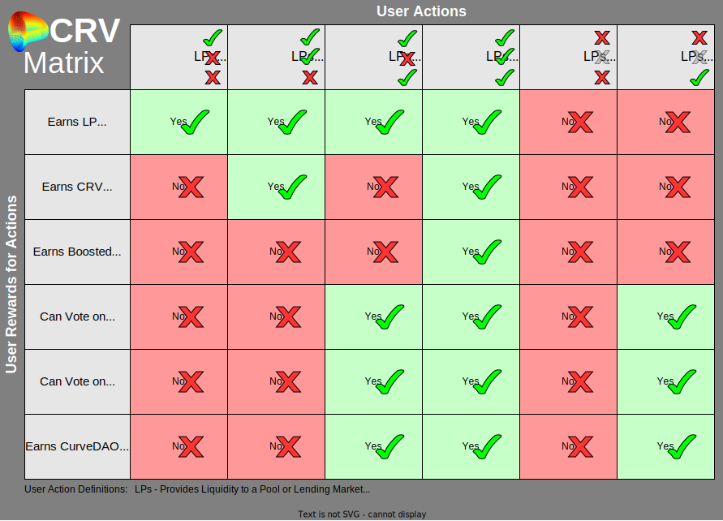

The CRV token is the token for Curve DAO which governs the whole Curve Finance ecosystem.  CRV was launched on August 13, 2020.

## Supply

The total supply of 3.03 billion is distributed as such:

- 57% inflation distributed via gauges
- 30% to shareholders (team and investors) with 2-4 years vesting
- 5% to the DAO-controlled reserve
- 5% to pre TGE liquidity providers with 2-4 years vesting
- 3% to employees with 2 years vesting

todo: pie chart

:::info Test
    The only token inflation left is the distribution via gauges. Up until today, all the vesting has been finished. The emission schedule follows 2^(1/4) and reduces by approximately by 16% each year. 

    Current inflation rate is approx 376459 CRV per day.
:::

The initial supply of around 1.3b (~43%) was distributed as such:

* 5% to pre-CRV liquidity providers with 1 year vesting
* 30% to shareholders (team and investors) with 2-4 years vesting
* 3% to employees with 2 years vesting
* 5% to the community reserve

CRV inflation (community emissions for providing liquidity) started at 274 million tokens a year in 2020, and each year it decreases by roughly 16%.

See the [Supply & Distribution page](./supply-distribution.md) for more detailed information.

---

## Utility

There are 4 main use-cases for CRV, which are all granted when [locking CRV](../vecrv/locking-your-crv.md):

1. Participating in governance by voting on governance proposals or directing CRV inflation (see 3.).
2. Boosting CRV rewards up to 2.5x on provided liquidity.
3. Directing CRV inflation to different liquidity pools or lending markets.
4. Earning protocol fees.

## The CRV Matrix

The table below can help you understand the value of CRV and veCRV in different situations:

