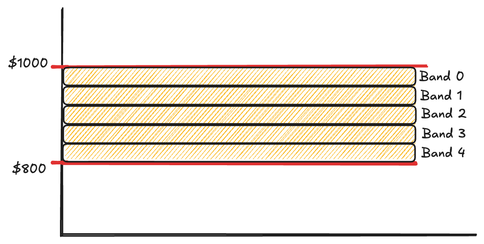
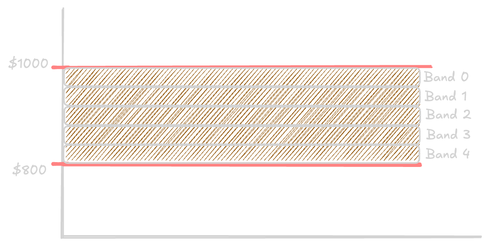
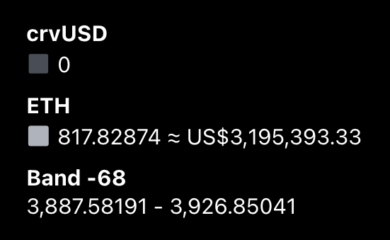
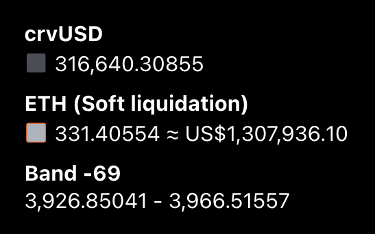
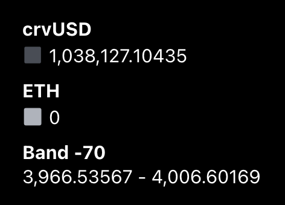
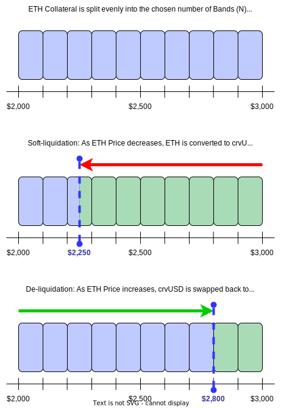
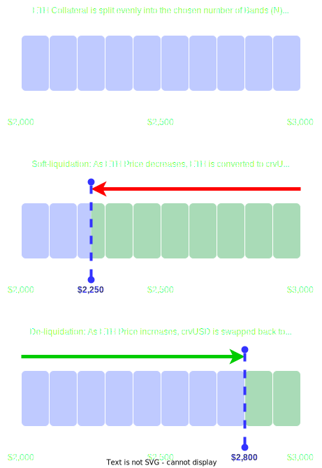

# Bands (N)

On Curve, loans have a liquidation range — a specific price interval where collateral is liquidated. This range is divided into smaller segments called bands.

Each band (also called N) represents a narrow price interval with an upper and lower bound. When a loan is created, the borrower can choose between 4 and 50 bands. The collateral is then distributed equally across all selected bands. Together, these bands make up the full liquidation range.

Bands function as individual liquidation zones. If the market price of the collateral enters a specific band, the assets in that band begin to be liquidated. As the price declines through the bands, more collateral is progressively converted into crvUSD. When the price moves back up, the process reverses: crvUSD is used to repurchase the collateral, restoring the position band by band.

:::info Example: Soft- and De-Liquidation
Consider a loan with 5 bands, covering a liquidation range from $1000 to $800. Each band spans $40:

- Band 4: $1000 to $960  
- Band 3: $960 to $920  
- Band 2: $920 to $880  
- Band 1: $880 to $840  
- Band 0: $840 to $800  

The collateral is evenly distributed across all five bands.

As the market price of the collateral falls:

- When the price drops below $1000, **Band 4** begins soft-liquidation. As the price moves down toward $960, the collateral in Band 4 is gradually converted into crvUSD.
- Once the price hits $960, **Band 4** is fully liquidated.
- The process continues with **Band 3**: as the price drops from $960 to $920, Band 3 is also fully soft-liquidated and converted into crvUSD.
- The price then enters **Band 2** (spanning $920 to $880). As it moves lower within this band, part of the collateral in Band 2 starts being liquidated.

At this point, the price **reverses direction somewhere within Band 2** (e.g., at $900) and begins to rise again:

- De-liquidation starts in **Band 2**. The crvUSD obtained earlier is now gradually used to buy back the collateral as the price increases within this band.
- Once the price crosses $920, **Band 2** is fully restored.
- As the price continues upward, **Band 3** is de-liquidated: crvUSD is used to repurchase the original collateral.
- This continues into **Band 4**, which is fully restored by the time the price reaches $1000.

In this example, **Bands 4 and 3 were fully soft-liquidated**, **Band 2 was partially liquidated**, and then the entire process was reversed as the price recovered.
:::

import Tabs from '@theme/Tabs';
import TabItem from '@theme/TabItem';

<Tabs>
  <TabItem value="light" label="Light Mode">
    
  </TabItem>
  <TabItem value="dark" label="Dark Mode">
    
  </TabItem>
</Tabs>

  
In this example, the total liquidation range is between $1000 and $800. The loan has a total of 5 bands which are equally distributed across the range. For example, Band 4 has price bounds of $1000 and $960, Band 3 spans $960 to $920, and so on, with the final band (Band 0) covering $840 to $800.

- **Collateral price is above the band:** This band has not been liquidated. The position remains fully in the volatile collateral asset.
    

- **Collateral price is within the band:** This band is currently being liquidated, involving active buying and selling (depending on whether it is soft-liquidation or de-liquidation) between the collateral asset and crvUSD. As a result, the position consists of a mix of volatile collateral and crvUSD.
    

- **Collateral price is below the band:** This band has been fully liquidated and is entirely held in crvUSD.
    

# Liquidations

LLAMMA (Lending-Liquidating AMM Algorithm) is the engine behind Curve's crvUSD liquidation mechanism. It's a two-token AMM—similar in structure to Uniswap V3—that manages collateral and crvUSD within a system of price "bands" (also called ticks). These bands define a loan's liquidation range and are key to how LLAMMA automatically protects positions.

A full comparison of borrowing on Curve vs. other protocols can be found [here](./overview.md#comparison-to-other-protocols).

When a loan is opened, collateral is distributed across a specified number of bands in the AMM. Together, these bands define the liquidation range for the position. Each band functions as a small liquidation zone, where gradual rebalancing occurs as prices change.

Unlike traditional systems, liquidation in LLAMMA does not immediately close a loan. Instead, it **soft-liquidates** and **de-liquidates** the collateral (explained below). This process only happens when the loan is within the liquidation range. Outside this range, no rebalancing occurs and the collateral remains unchanged.

Losses can accumulate during these operations due to factors like market volatility, price slippage, and available liquidity. A loan is [hard-liquidated](#hard-liquidation) only once its health reaches 0%.

## Soft- and De-Liquidation

As the price of the collateral asset decreases and enters the liquidation range — defined by two price boundaries — the system progressively converts the volatile collateral into crvUSD. This reduces exposure to the declining asset. If the price rises again within the same range, the system reverses the process, using crvUSD to buy back the collateral and restore exposure to the volatile asset.

:::info Visualising Liquidation
LLAMMA soft-liquidation can also be explored through static visual guides:

<Tabs>
  <TabItem value="light" label="Light Mode">
    
  </TabItem>
  <TabItem value="dark" label="Dark Mode">
    
  </TabItem>
</Tabs>
:::

:::warning Soft-liquidation ≠ Safety
A loan can still be hard-liquidated even *below* the soft-liquidation range if health drops to 0%.  
Likewise, loans inside the range can remain safe if health stays above 0%.
:::

This continuous buying and selling between the collateral asset and crvUSD leads to **losses**, due to price movement, fees, and rebalancing inefficiencies. Losses can occur both when the price decreases *and* when it increases, but only while the loan is inside the liquidation range.

## Losses in Liquidation

When a loan enters the **liquidation range**, **losses occur**. These losses are difficult to quantify precisely, as they depend on various external factors.

:::warning Misconception
A common misconception is that once a loan enters the liquidation range, it **cannot be liquidated** if the collateral price begins rising again. While this may seem intuitive, **liquidation losses can also occur as the price moves upward.**
:::

Several factors influence the extent of these losses:

- **Number of Bands:** A higher number of bands reduces losses. Positions created with the maximum of **50 bands** have remained in liquidation mode for **months** while losing only a small percentage of loan health.
- **Market Volatility:** Sudden price drops tend to produce **larger losses**, whereas slower, more gradual changes allow smoother rebalancing and **lower losses**.
- **Liquidity Conditions:** Deep liquidity (e.g., BTC, ETH, LSDs) helps minimize losses, enabling more efficient arbitrage and rebalancing.

Ultimately, **losses within the liquidation range are inevitable**, but can be minimized by understanding how band configuration, volatility, and liquidity affect performance.

## Self-liquidation

Self-liquidation allows users to voluntarily close their position while in soft-liquidation, typically to avoid a worse outcome from hard-liquidation. If part of your collateral has already been converted to crvUSD, you can use that to repay a portion of your debt — reducing the total you need to repay manually.

Here's a simple example:

> Alice borrowed 1,000 crvUSD using 1 WETH as collateral. Her position enters soft-liquidation, and 0.2 WETH is swapped for 250 crvUSD.  
> Her position now consists of:  
> – Debt: 1,000 crvUSD  
> – Collateral: 0.8 WETH + 250 crvUSD  
>  
> To self-liquidate, Alice only needs to repay **750 crvUSD**, and she recovers her **0.8 WETH**.

This is usually better than letting the loan be hard-liquidated, because it avoids penalties like the [`liquidation_discount`](./loan-concepts.md#market-parameters).

## Hard-liquidation

Hard-liquidation occurs only when the [health](./loan-concepts.md#loan-health) of a loan falls below 0%. At this point, **any user** can repay the loan and receive the borrower's remaining collateral.

After a hard-liquidation:
- The borrower keeps the borrowed crvUSD.
- The borrower loses their remaining collateral.
- The liquidator receives the collateral, often at a discount.

:::important Key Facts
- Hard-liquidation is triggered **only** at 0% health — not by hitting the bottom of the soft-liquidation range.
- A user can be far below the liquidation range but still safe if their health > 0%.
- Repaying debt:
    - In soft-liquidation: increases health but keeps the range the same.
    - Outside soft-liquidation: increases health *and* moves the range lower.
:::

Hard-liquidation is usually worse than self-liquidation. In one real example, a borrower lost over **11,000 crvUSD more** by being hard-liquidated instead of self-liquidating.

:::warning What Happens After?
After a hard-liquidation:
- The loan is **closed** permanently. You cannot repay or recover any part of your collateral.
- The position is effectively over — your only remaining asset is the borrowed crvUSD.
- Even if the market later recovers, the collateral is not returned.
:::

# Tips for Managing Liquidation Risk

Understanding LLAMMA is important — but knowing how to act on that knowledge is even more valuable. Here are some practical tips for protecting your loan:

- **Use more bands** (up to 50) to smooth out soft-liquidation and reduce loss severity.
- **Choose liquid assets** as collateral (e.g., ETH, wstETH, BTC). Less liquid assets tend to suffer higher losses in volatile conditions.
- **Monitor your loan health regularly**, especially during major market movements.
- **Repay debt proactively** when health starts to drop — early intervention prevents deeper losses.
- **Consider self-liquidation** when you're deep in soft-liquidation to avoid liquidation discounts.
- **Understand how repayment affects your bands:**
    - Inside soft-liquidation: improves health but keeps bands unchanged.
    - Outside soft-liquidation: improves health *and* pushes liquidation range lower.

# Common Edge Cases

:::question What if price hovers at a band boundary?
The system treats price movement continuously. The closer the price is to a boundary, the smaller the amount of collateral being converted. Small price oscillations around a boundary will cause small-scale liquidation or de-liquidation in that band.
:::

:::question What if all my bands are fully liquidated?
Your entire position will be in crvUSD, but **you are not hard-liquidated** unless your health reaches 0%. You can still repay and recover your position, or self-liquidate.
:::

:::question Can I use the crvUSD in my collateral to repay?
Not directly — crvUSD that has been acquired through liquidation is still considered part of your **collateral**, not your **wallet balance**. However, if you self-liquidate, the crvUSD inside your collateral is automatically counted toward repayment, reducing the amount you need to send manually.
:::